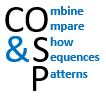
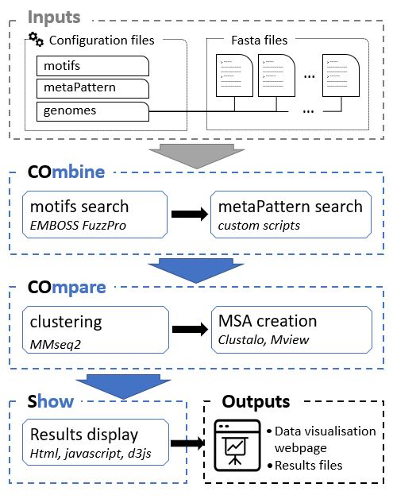
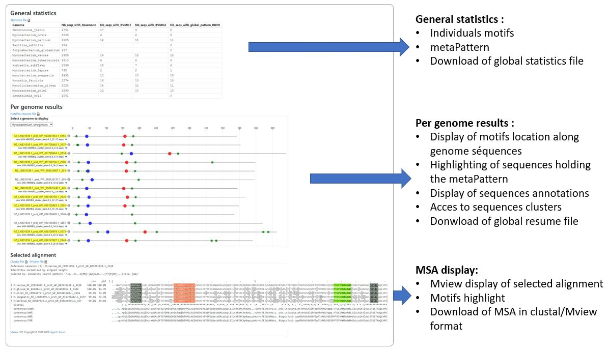

# COSP: COmbine, COmpare and Show Sequences Patterns

COSP is a workflow which identifies in whole genomes motifs that appear in a precise order defining a global pattern (metaPattern).  
Sequences respecting the defined metaPattern are clustered together and a multiple alignment is performed within each cluster.  
All results: individual patterns, metaPattern, clusters, MSA are displayed in a web environment users to explore them.  

An example of the results produced and the visualization environment is available here: [BVMO_type1_Tomas_et_al_2021](https://smartbioinf.github.io/BVMO_type1_Tomas_et_al_2021/). These results were produced in the context of a study of the BVMO type 1 pattern in 14 actinobacteria (Toma et al. 2021)

## Documentation 

The COSP user guide is available in our [GitHub Wiki](https://github.com/SmartBioInf/COSP/wiki).  
For questions please open an issue on GitHub or ask to Sylvain Marthey.

An example of workflow configuration and output is available on dedicated github repositiry : [BVMO_type1_Tomas_et_al_2021](https://github.com/SmartBioInf/BVMO_type1_Tomas_et_al_2021)

## Workflow orverview

## Results page Overview

